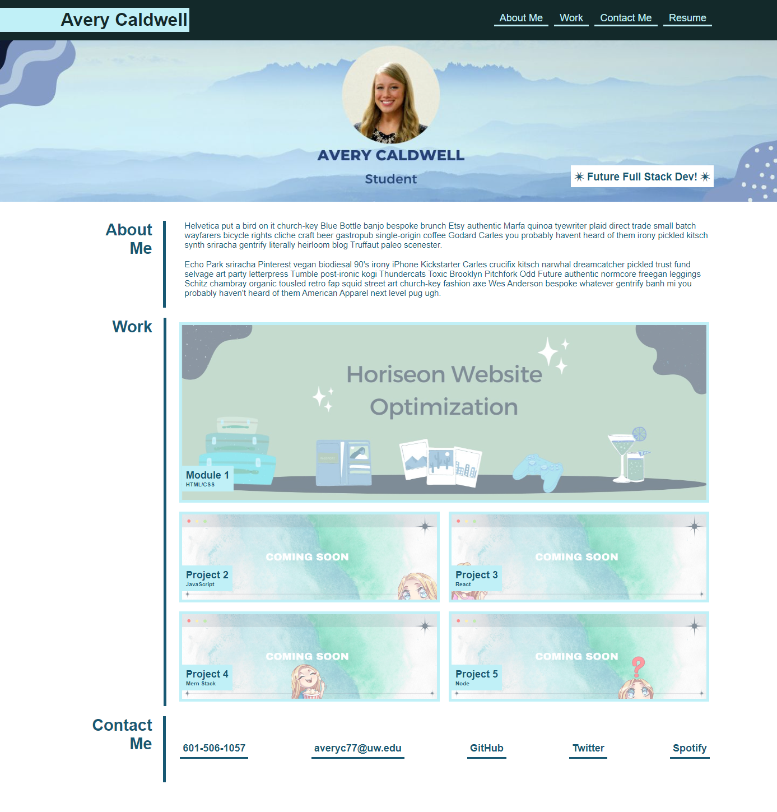

# Portfolio-Mockup-CSS

## Table of contents
​
- [Overview](#overview)
  - [The Challenge](#the-challenge)
  - [Screenshot](#screenshot)
  - [Links](#links)
- [My process](#my-process)
  - [Built with](#built-with)
  - [What I learned](#what-i-learned)
  - [Continued development](#continued-development)
  - [Useful resources](#useful-resources)
- [Author](#author)
- [Acknowledgments](#acknowledgments)
​

​
## Overview
​
### **The Challenge**

​
User Story

- AS AN employer
- I WANT to view a potential employee's deployed portfolio of work samples
- SO THAT I can review samples of their work and assess whether they're a good candidate for an open position


Acceptance Criteria

- GIVEN I need to sample a potential employee's previous work
- WHEN I load their portfolio
- THEN I am presented with the developer's name, a recent photo or avatar, and links to sections about them, their work, and how to contact them
- WHEN I click one of the links in the navigation
- THEN the UI scrolls to the corresponding section
- WHEN I click on the link to the section about their work
- THEN the UI scrolls to a section with titled images of the developer's applications
- WHEN I am presented with the developer's first application
- THEN that application's image should be larger in size than the others
- WHEN I click on the images of the applications
- THEN I am taken to that deployed application
- WHEN I resize the page or view the site on various screens and devices
- THEN I am presented with a responsive layout that adapts to my viewport


​
### Screenshot
​

​
​
### Links
​
- Solution URL: [https://github.com/AveryCaldwell/portfolio-mockup-css](https://github.com/AveryCaldwell/portfolio-mockup-css)
- Live Site URL: [https://averycaldwell.github.io/portfolio-mockup-css/](https://averycaldwell.github.io/portfolio-mockup-css/)
​
## My process
​
### Built with
​
- Semantic HTML5 markup
- CSS custom properties
- Mobile-first workflow
- Git/Git pages
​
​
​
### What I learned

 - While working on this project, I learned how to use use multiple classees within an element in order to prevent redundant CSS and make it easier to read.
 - In regard to z-index, I learned how to change the order of the elements so the label is over the image.
 - This is the first time I have used " :root " and it made keeping the color scheme consistent much easier.

```html
< image src="./Assets/images/top-photo1.jpg" class="grid-img img-border" alt="project 1" />
```
​
 - I am proud of this code because it resembles the mock-up functionality, but is still personalized to me. 
 - I also enjoyed customizing the CSS to reflect my personality and creativity. 


```css
:root {
  --gray: #13292a;
  --lightblue: #c0f0f7;
  --bgcolor: rgb(255, 255, 255);
  --darkblue: #175873;
}

.grid-label {
  display: block;
  text-align: left;
  position: absolute;
  left: 0;
  bottom: 15px;
  color: var(--darkblue);
  background-color: var(--lightblue);
  padding: 7px;
  z-index: 2;
}
.grid-img {
  width: 100%;
  display: block;
  opacity: 50%;
  z-index: 1;
}
```


​
### Continued development
​
I want to further my understanding of z-index because it would have saved time when creating this webpage. I would also like to better understand default settings in relation to the parent and siblings.


​
### Useful resources
​
- [https://www.w3schools.com/cssref/pr_pos_z-index.php/](https://www.w3schools.com/cssref/pr_pos_z-index.php/) - This helped me understand z-index. It provided an easy visual to follow and obtain a better understanding for positioning elements. 
- [https://developer.mozilla.org/en-US/docs/Web/CSS/transition](https://developer.mozilla.org/en-US/docs/Web/CSS/transition8) - This is a great guide on creating transitions.
​

​
## Author
  Avery Caldwell
- GitHub - [AveryCaldwell](https://github.com/AveryCaldwell)
​
​